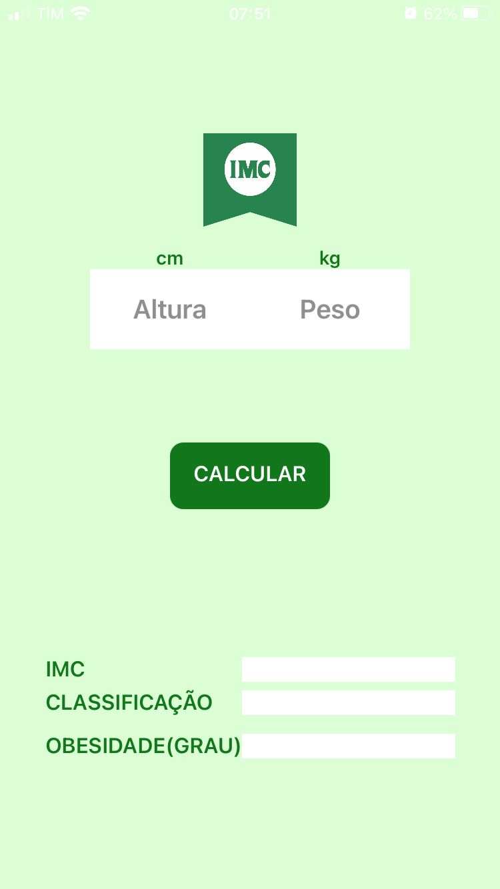
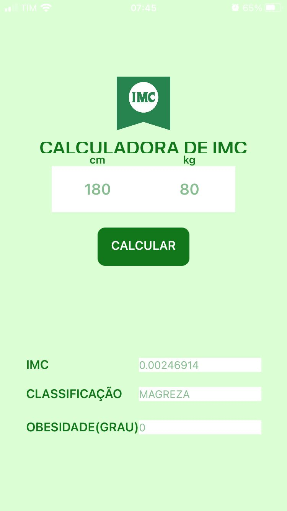

# Aplicativo Calculadora de IMC

## Visão geral

O aplicativo Calculadora de IMC (Índice de Massa Corporal) é um aplicativo fácil de usar desenvolvido usando o MIT App Inventor. Este aplicativo permite aos usuários calcular seu IMC com base no peso e na altura. O IMC é um índice simples de peso por altura comumente usado para classificar baixo peso, peso normal, sobrepeso e obesidade em adultos.

## Características

- **Entrada do usuário**: os usuários podem inserir seu peso em quilogramas e altura em metros.
- **Cálculo Instantâneo**: O aplicativo calcula o IMC instantaneamente ao inserir as informações necessárias.
- **Interpretação do resultado**: O aplicativo fornece uma interpretação clara do resultado do IMC, categorizando-o como baixo peso, peso normal, sobrepeso ou obesidade.
- **Interface Simples**: Uma interface fácil de usar, adequada para todas as faixas etárias.

## Ferramentas de desenvolvimento

- **MIT App Inventor**: um ambiente de desenvolvimento integrado baseado na Web para a criação de aplicativos Android.
- **Componentes usados**:
   - TextBox: Para entrada do usuário (peso e altura).
   - Botão: Para acionar o cálculo do IMC.
   - Etiqueta: Para exibir o resultado e a interpretação.

## Como usar

1. Abra o aplicativo Calculadora de IMC em seu dispositivo Android.
2. Insira seu peso em quilogramas no campo de entrada designado.
3. Insira sua altura em metros no campo de entrada designado.
4. Pressione o botão “Calcular IMC”.
5. O aplicativo exibirá seu IMC junto com uma interpretação de sua categoria de peso.

## Lógica de cálculo do IMC

A fórmula usada para calcular o IMC é:
\[ \text{IMC} = \frac{\text{peso (kg)}}{\text{altura (m)}^2} \]

### Interpretação dos resultados do IMC

- **Baixo peso**: IMC inferior a 18,5
- **Peso normal**: IMC 18,5–24,9
- **Excesso de peso**: IMC 25–29,9
- **Obeso**: IMC 30 ou superior

## Capturas de tela do aplicativo

  
  ]

## Instalação

1. Baixe o arquivo APK do aplicativo Calculadora de IMC.
2. Transfira o arquivo APK para o seu dispositivo Android.
3. Abra o arquivo APK e siga as instruções na tela para instalar o aplicativo.

## Melhorias Futuras

- **Unidades Imperiais**: Suporte para peso em libras e altura em polegadas.
- **Dicas de saúde**: forneça dicas de saúde e condicionamento físico com base nos resultados do IMC.
- **Suporte multilíngue**: suporte para vários idiomas para atingir um público mais amplo.

## Licença

Este projeto está licenciado sob a licença MIT - consulte o arquivo [LICENSE](LICENSE) para obter detalhes.

## Reconhecimentos

- Obrigado aos desenvolvedores do MIT App Inventor por fornecerem uma plataforma fácil para desenvolver aplicativos Android.
- Inspiração em vários tutoriais online e documentação sobre cálculos de IMC.

## Contato

Para qualquer dúvida ou sugestão, entre em contato:

- **E-mail**: gustavorodrigues11cr@gmail.com
- **GitHub**: [gustavoasousa07]((https://github.com/gustavosousa07))

---

Obrigado por usar o aplicativo Calculadora de IMC! Seu feedback é valioso para nós.
